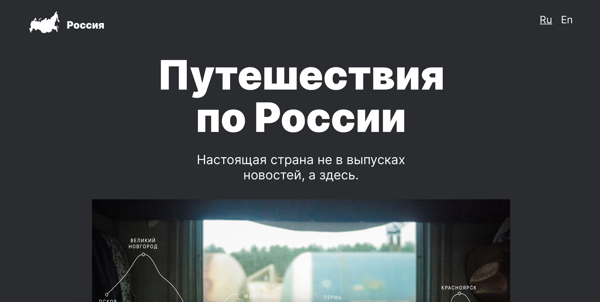

# Путешествие по России
https://sseverniy.github.io/russian-travel/index.html  

## Описание  

Это проект, который позволит вам путешествовать от Пскова до Улан-Удэ, сидя дома. Вы вдохновитесь потрясающими фотографиями с путешествия и изучите самые крупные и интересные регионы.  
Есть возможность перейти по ссылке для более детального изучения конкретных локаций.  
Спасибо Яндекс Практикуму за макет (https://www.figma.com/file/OyRWEjU6wBwRe1hapzQoLx/Sprint-3%3A-Russia-%2F-desktop-%2B-mobile?node-id=28503%3A0).
## Какие технологии были использованы?
При создании нашего сайта была использована конструкция gridLayout, flebox. Также сайт был адаптирован для разных типов устройств для удобства пользования. Файловая структура основана на методологии БЭМ.
